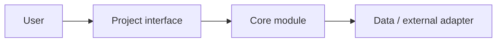

# helsinki-rag-gcp

[](https://github.com/jussiohag/helsinki-rag-gcp/actions/workflows/ci.yml)
[](LICENSE)

TODO: add project description

## Features

- TODO: state the three most useful capabilities

## Demo

TODO: add a screenshot, short demo, or live HTTPS link for user-facing projects.

## Quick Start

```bash
# TODO: list prerequisites and copy-paste setup instructions
```

## Architecture



Replace this diagram with the smallest accurate view of the real implementation. Label network and trust seams when relevant.

## Usage

TODO: show the primary workflow and common options.

## Tech Stack

- TODO: list technologies

## Development

```bash
make lint    # run linter
make test    # run tests
make build   # build project
make ci      # all of the above
```

## Security

TODO: document permissions, network/data behavior, credentials, and vulnerability reporting. Link `SECURITY.md` when present.

## Compatibility and Limitations

- TODO: supported platforms/browsers/runtimes
- TODO: known limitations and non-goals

## License

MIT — see [LICENSE](LICENSE).
