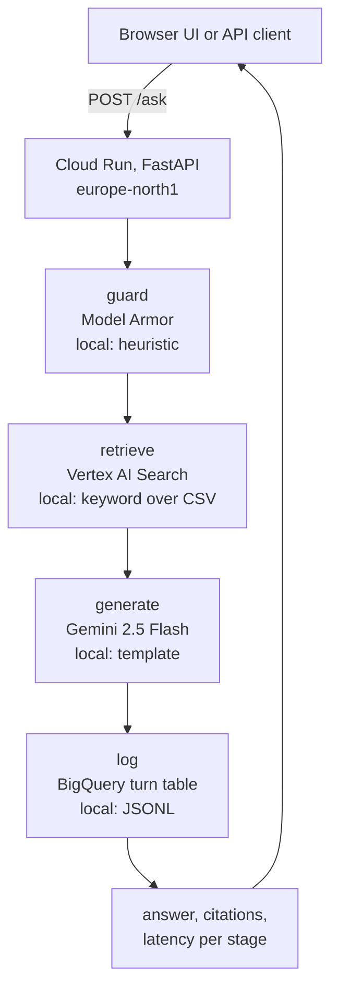

# helsinki-rag-gcp

[](https://github.com/jussiohag/helsinki-rag-gcp/actions/workflows/ci.yml)
 
[](LICENSE)

Question-answering service over Helsinki's public service points. Ask in
plain language, get a grounded answer with citations. Runs on Cloud Run,
Vertex AI Search and Gemini in europe-north1, with an evaluation gate in CI
and a per-stage latency budget. Everything also runs locally with no cloud
account.

## Features

- Grounded answers with citations over 21,498 Helsinki service points
- Browser UI at `/` and a JSON API at `/ask`
- Per-stage latency (guard, retrieve, generate, log) measured on every
  request and checked against a budget
- Evaluation gate in CI: hit@5 and citation checks on a golden set, the
  build fails below threshold
- Every cloud adapter has a local twin, so tests and the eval run with no
  cloud account
- Terraform for Cloud Run, Vertex AI Search, Model Armor and BigQuery in
  europe-north1

## Quick Start

```bash
make test      # offline, local retriever over the 21,498-row CSV
make eval      # golden set, hit@5 and citation checks, fails below thresholds
make run       # POST :8080/ask {"question":"Where is the nearest library in Kannelmäki?"}
./deploy.sh    # build on Cloud Build, terraform apply, print the Cloud Run URL
```

## Try it

```bash
make run   # starts the API on :8080 with the local, offline adapters
```

Then open `http://localhost:8080/` in a browser. You'll see a small page
with a question box, three example questions in Finnish (a library, a
daycare, a health station), and language/channel selectors. Submitting a
question shows the generated answer with citation ids highlighted, a
latency bar for each request stage against the budgets in
`docs/LATENCY.md`, the retrieved passages as cards with their score and
source link, the guard's decision, and which model answered. A blocked
question comes back with its guard reason shown in red. A footer line
reports which adapters (local or cloud) are currently active, read from
`GET /healthz`.

## Architecture

See [`docs/ARCHITECTURE.md`](docs/ARCHITECTURE.md) for the full request
path, the adapter/environment-variable contract, the data model, the
content pipeline, the eval gate, the Terraform-managed infrastructure,
and security notes.



Each stage is an adapter selected by an environment variable; the default
is always the local twin.

## Eval

`make eval` runs the golden set against the local twins and fails the build
below threshold. Output on main, 2026-09-07:

```text
metric             value  threshold
hit_at_5            1.00  >= 0.8
citation_ok         1.00  >= 1.0
p50_latency_ms     126.3  -
p95_latency_ms     184.7  -
```

Implementation plan and the cloud adapter contract:
`docs/plans/2026-09-07-helsinki-rag-gcp.md`.

## Deploy

`./deploy.sh` builds the container on Cloud Build, pushes it to Artifact
Registry, and applies the Terraform module in `infra/terraform/` (see that
directory for the resources it creates). The target project needs these
APIs enabled: `run`, `discoveryengine`, `aiplatform`, `bigquery`,
`artifactregistry`, `cloudbuild`, `modelarmor`.

Per-stage latency budget: [`docs/LATENCY.md`](docs/LATENCY.md).
Monthly cost estimate at 10k/100k questions: [`docs/COST.md`](docs/COST.md).

## Data

`data/helsinki_service_points.csv` comes from the City of Helsinki
Service Map (Palvelukartta) REST API v4, unit endpoint:
`https://www.hel.fi/palvelukarttaws/rest/v4/unit/`. It holds 21,498
service points across Helsinki, Espoo, Vantaa and Kauniainen,
downloaded in 2026.

License: see the Service Map open data terms at
https://www.hel.fi/palvelukarttaws/restpages/index_en.html. As
published there, the REST API's data is covered by the Creative
Commons Attribution 4.0 International license (CC BY 4.0), and any
reuse must credit "City of Helsinki Service Map
(https://servicemap.hel.fi)" as the data's administrator.

The phone numbers, addresses and URLs in the CSV are public
service-point contact details published by the city, not personal
data about individuals.

This CSV is a static snapshot, not refreshed automatically. There is
no download script in this repo; re-fetching it means pulling the
same unit endpoint again and replacing the file, then re-running
`scripts/ingest_to_jsonl.py` to rebuild the Vertex AI Search JSONL
before re-importing it into the data store.

## Development

```bash
make setup   # uv sync
make lint    # ruff
make test    # pytest, 45 tests, no network
make eval    # golden set, exits 1 below threshold
make ci      # all of the above
```

Conventions and layout: [`CONTRIBUTING.md`](CONTRIBUTING.md).

## License

MIT. See [LICENSE](LICENSE).
